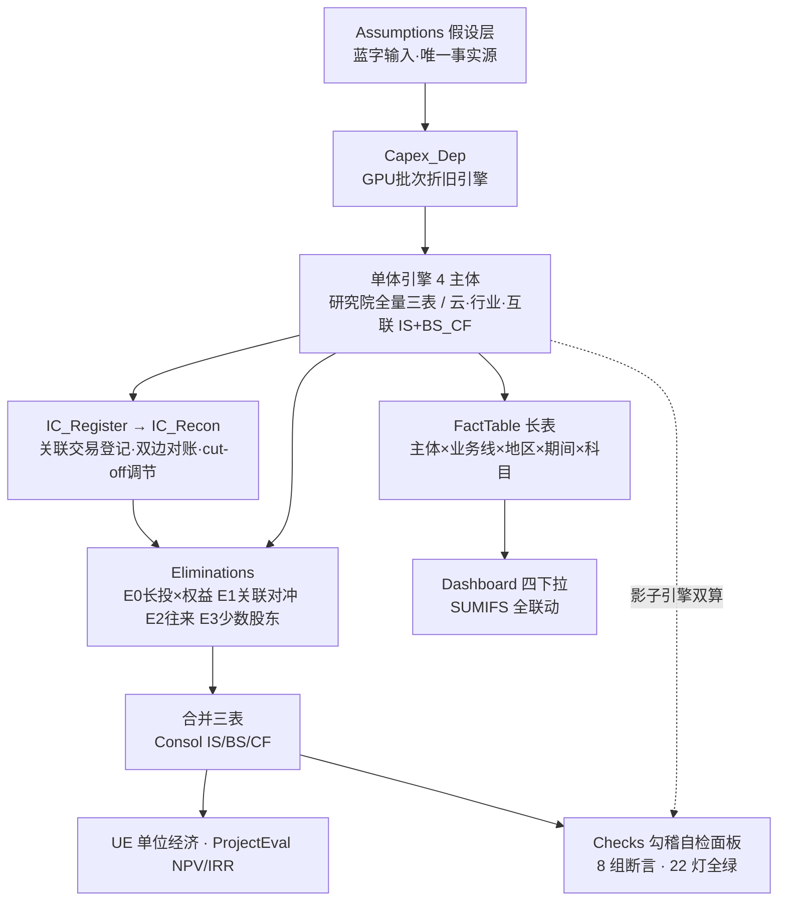
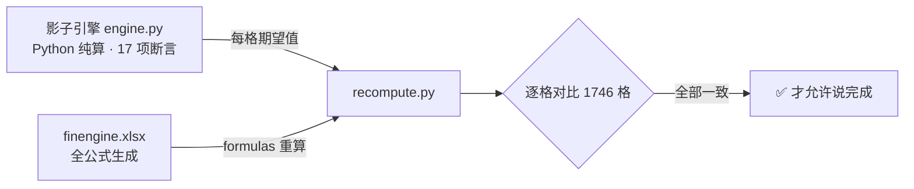

# finengine · 用 AI 手搓一个会自我验证的集团财务模型

> 虚构「智擎集团」（参考智谱商业模式），从零生成的集团财务 Excel package。
> 不是填数字的表格——**是一个活的模型**：改一个蓝字假设，23 张 sheet 全部重算，勾稽断言实时亮灯。

[]() []() []()

## 为什么做这个

财务建模的三个老大难：**做错不知道**（勾稽靠肉眼）、**改不动**（硬编码数字一改就乱）、**讲不清**（只有成品没有思路）。
这个项目用一套工程化方法把三个问题一起解掉——模型自己证明自己是对的。

## 一分钟架构



**验证闭环（本项目的灵魂）**：同一套财务逻辑算两遍——



## 五支柱方法论

| 支柱 | 一句话 | 解决什么 |
|---|---|---|
| **倒挤现金法** | BS 现金 = 负债+权益−非现金资产 | 资产负债表结构性平衡，免循环引用 |
| **影子引擎双算** | Python 算一遍 + Excel 公式算一遍，逐格对比 | 做错了一定知道（实战抓出 9 个 bug） |
| **Layout 坐标注册器** | 坐标↔语义key↔期望值 一处真相 | 多 agent 并行写 sheet 不冲突 |
| **分层 DAG + Gate** | 地基→单体→合并→分析→检查，每层验证后放行 | 复杂度可控，坏了知道坏在哪层 |
| **证据在表里** | 每张 sheet 底部差异行应全 0，Checks 总灯 | 不靠嘴说"应该可以了" |

## 模型里有什么

- **集团视角**：研究院（关联收入方）+ 智擎云 MaaS + 智擎行业（私有化+解决方案）+ 智擎互联 C 端（80% 持股→少数股东）
- **关联交易全家桶**：T1 license / T2 定制研发 / T3 算力转售 / 60 天往来挂账 / E0-E3 合并抵消
- **一笔活的 cut-off**：IC_Recon 埋了 220 万在途（互联已确认、云未开票）→ 对账矩阵亮差异 → 调节表归零——模拟真实月末关账
- **四下拉看板**：主体/业务线/地区/期间 任意切换，SUMIFS 实时联动
- **UE 模型**：MaaS 单 token 剪刀差、LTV/CAC、C 端单用户回本周期
- **项目评估**：3 个私有化项目 NPV/IRR + 16 格敏感性矩阵（结论反直觉：小合同+短交付+高运维利润率 胜过大合同）

## 快速开始

```bash
git clone <this-repo> && cd finengine
python3 -m venv .venv && .venv/bin/pip install openpyxl formulas
.venv/bin/python src/engine.py        # 影子引擎 17 项断言
.venv/bin/python src/build.py         # 重建 dist/finengine.xlsx（23 sheets）
.venv/bin/python src/recompute.py     # 双引擎重算 1746 格对比
```

打开 `dist/finengine.xlsx`：Cover 导航 → Checks 看 22 绿灯 → Dashboard 玩四下拉 → **Assumptions 随便改个蓝字**，回来看全模型联动。

## 目录导览

```
skill/finmodel-builder/SKILL.md  ← 给 Agent 的可复用方法论（本项目的提炼）
docs/2026-08-25-design.md        ← 设计文档（集团架构/关联交易/勾稽体系）
src/engine.py                    ← 影子引擎（勾稽逻辑的唯一真相）
src/assumptions.py               ← 全部财务假设（有注释的虚构数据）
src/layout.py + recompute.py     ← 坐标注册器 + 双引擎验证器（可复用骨架）
src/gen_*.py                     ← 各 sheet 生成器（M4 三张由 subagent 并行交付）
dist/finengine.xlsx              ← 成品模型
```

## 把这套方法用在你的模型上

安装 skill（Claude Code）：

```bash
git clone <this-repo> && cp -r <this-repo>/skill/finmodel-builder ~/.claude/skills/
```

然后对 Claude 说"**手搓一个 XX 公司的全公式财务模型**"即可触发。方法论与行业无关——换 `assumptions.py` 就是另一家公司。

## 已知简化（模型诚实度的一部分）

- 内部 license 当期结转，无未实现利润抵消
- 所得税不结转亏损；财务费用/利息收入不计
- 母公司长投成本法，合并差额进资本公积
- BS/CF 科目无业务线/地区维度（Dashboard 仅 IS 四维联动）

全部明细与踩坑记录见 [docs](docs/) 与各文件头部注释。

---
*数据为虚构（量级参考大模型公司公开信息校准），仅供方法演示。*
