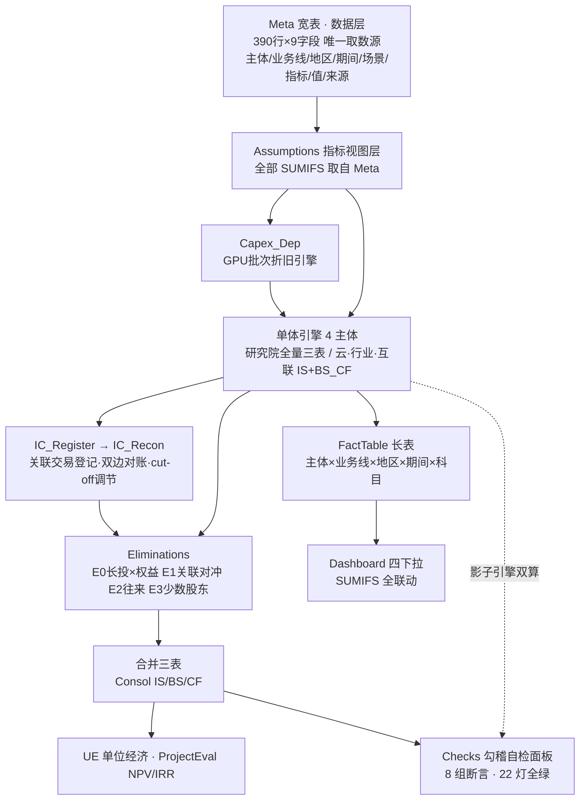
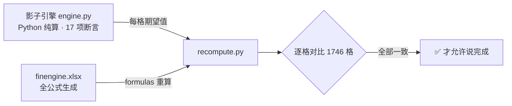

# finengine · 从元数据出发，用 AI 手搓会自我验证的集团财务模型

> 虚构「智擎集团」（参考智谱商业模式），从零生成的集团财务 Excel package。
> **数据与逻辑分离**：所有数字住在一张 Meta 宽表里（390 行 × 9 字段），引擎只认 Meta 接口——
> 换一家公司 = 换一份数据；进公司接真实 ERP = 往 Meta 按期灌数，三表引擎零改动。

[]() []() []() []()

## 为什么做这个

财务建模的三个老大难：**做错不知道**（勾稽靠肉眼）、**改不动**（硬编码数字一改就乱）、**讲不清**（只有成品没有思路）。
再加上 FP&A 的真日常：**换数据源就重做**。这个项目用一套工程化方法把四个问题一起解掉——
Anaplan/Pigment 这类 planning 工具的内核（一张维度化宽表驱动一切），在 Excel + Python 里手搓出来。

## 一分钟架构



**数据与逻辑分离（roundtrip 可运行证明）**：

```bash
$ python tests/test_meta_roundtrip.py
从 xlsx 读回 Meta：390 行
对比 840 格 → ✅ 全部一致
结论：换数据源（xlsx 灌数）→ 引擎零改动 → 三表输出完全一致
```

**验证闭环（本项目的灵魂）**：同一套财务逻辑算两遍——



## 六支柱方法论

| 支柱 | 一句话 | 解决什么 |
|---|---|---|
| **Meta 数据契约** | 所有数字住一张宽表（含 scenario 数据血缘） | 换公司/换数据源引擎零改动；FP&A 日常=设计指标字典+按期灌数 |
| **行业=指标字典** | 收入逃不出三种模式：量×价/客户×留存/项目×合同 | 行业适配变成填表，不是改代码 |
| **知识与逻辑分离** | 行业参数不许凭 AI 记忆硬编，走数据源降级链（招股书→tsdata 可比年报→…→诚实标"低置信度假设"） | 参数可审计、冷门行业不空转、宁可标"猜的"不冒充"查的" |
| **倒挤现金法** | BS 现金 = 负债+权益−非现金资产 | 资产负债表结构性平衡，免循环引用 |
| **影子引擎双算** | Python 算一遍 + Excel 公式算一遍，逐格对比 | 做错了一定知道（实战抓出 9 个 bug） |
| **Layout 坐标注册器** | 坐标↔语义key↔期望值 一处真相 | 多 agent 并行写 sheet 不冲突 |
| **分层 DAG + Gate** | 地基→单体→合并→分析→检查，每层验证后放行 | 复杂度可控，坏了知道坏在哪层 |

## 模型里有什么

- **集团视角**：研究院（关联收入方）+ 智擎云 MaaS + 智擎行业（私有化+解决方案）+ 智擎互联 C 端（80% 持股→少数股东）
- **关联交易全家桶**：T1 license / T2 定制研发 / T3 算力转售 / 60 天往来挂账 / E0-E3 合并抵消
- **一笔活的 cut-off**：IC_Recon 埋了 220 万在途（互联已确认、云未开票）→ 对账矩阵亮差异 → 调节表归零——模拟真实月末关账
- **四下拉看板**：主体/业务线/地区/期间 任意切换，SUMIFS 实时联动
- **UE 模型**：MaaS 单 token 剪刀差、LTV/CAC、C 端单用户回本周期
- **项目评估**：3 个私有化项目 NPV/IRR + 16 格敏感性矩阵（结论反直觉：小合同+短交付+高运维利润率 胜过大合同）

## 快速开始

```bash
git clone <this-repo> && cd finengine
python3 -m venv .venv && .venv/bin/pip install openpyxl formulas
.venv/bin/python src/engine.py              # 影子引擎 17 项断言
.venv/bin/python src/build.py               # 重建 dist/finengine.xlsx（24 sheets）
.venv/bin/python src/recompute.py           # 双引擎重算 1746 格对比
.venv/bin/python tests/test_meta_roundtrip.py  # 数据与逻辑分离的 roundtrip 证明
```

打开 `dist/finengine.xlsx`：Cover 导航 → Checks 看 22 绿灯 → Dashboard 玩四下拉 →
**去 Meta 表改一个 G 列数字**（比如 2026E 的 token 量），回来看全模型联动、Checks 不亮红灯。

## 目录导览

```
skill/finmodel-builder/SKILL.md  ← 给 Agent 的可复用方法论（四层架构+行业适配）
src/metric_dict.py               ← 指标字典（行业实例化：45 个指标×三种收入模式归类）
src/meta.py                      ← Meta 数据层（build/get/bind/load_from_xlsx）
src/assumptions.py               ← 行业配置（大模型公司实例，换行业改这份）
src/engine.py                    ← 影子引擎（只认 Meta 接口，行业无关）
src/layout.py + recompute.py     ← 坐标注册器 + 双引擎验证器（可复用骨架）
src/gen_*.py                     ← 各 sheet 生成器（M4 三张由 subagent 并行交付）
tests/test_meta_roundtrip.py     ← 数据与逻辑分离的可运行证明
dist/finengine.xlsx              ← 成品模型（Meta 表在第一张）
```

## 第二行业实例：连锁咖啡（skill 通用性实测）

[`examples/coffee/`](examples/coffee/)——用同一套 skill 从零搓的 **volume_price** 模式实例（门店×杯量×客单价），
12 sheets，与本项目（大模型公司）共享全部行业无关骨架（style/layout/gen_meta/recompute 零改动拷入）。

亮点是 **Step 1b 参数校准管道**：模型先验给的假设经 tsdata 拉 A 股连锁餐饮 4 家可比年报校准——
原假设 2027 净利率 25%，真实可比中位仅 7.3%/上限 13%，据此修正 3 个参数并落
Calibration 表（参数|原假设|真实区间|校准值|来源|偏差解释），Meta source 列标注真实出处。
行业结构差异（现制咖啡 vs 堂食餐饮）允许取区间外，但偏差解释必须写明。

## 把这套方法用在你的模型上

安装 skill（Claude Code）：

```bash
git clone <this-repo> && cp -r <this-repo>/skill/finmodel-builder ~/.claude/skills/
```

然后对 Claude 说"**手搓一个 XX 公司的全公式财务模型**"即可触发。方法论与行业无关——
换 `industry_config.py`（校准后参数）+ `metric_dict.py`（指标字典）就是另一家公司，
两个实例（大模型集团 / 连锁咖啡单主体）就是证明。

## 已知简化（模型诚实度的一部分）

- 内部 license 当期结转，无未实现利润抵消
- 所得税不结转亏损；财务费用/利息收入不计
- 母公司长投成本法，合并差额进资本公积
- BS/CF 科目无业务线/地区维度（Dashboard 仅 IS 四维联动）

全部明细与踩坑记录见 [docs](docs/) 与各文件头部注释。

---
*数据为虚构（量级参考大模型公司公开信息校准），仅供方法演示。*
